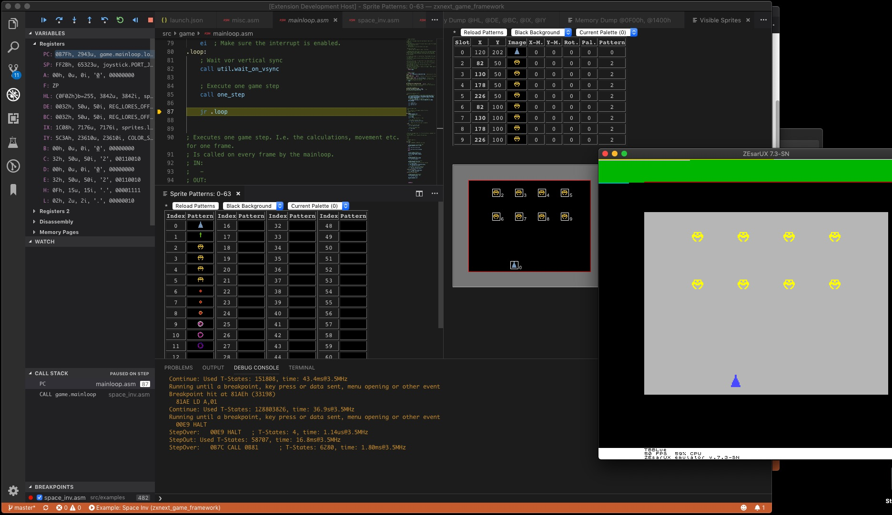
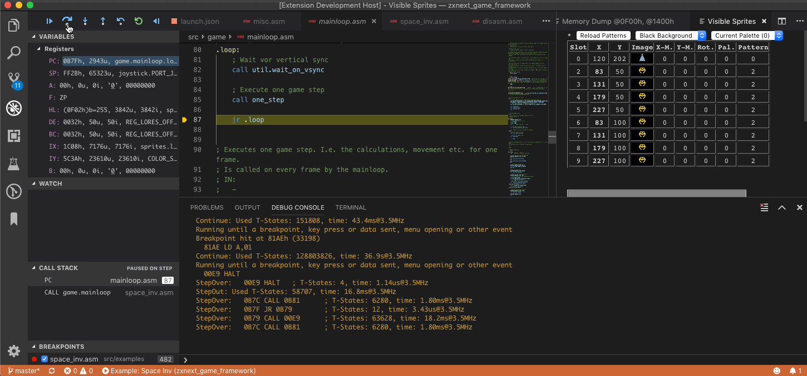

# DeZog - Z80 Debugger

**Note: you need to install at least ZEsarUX version 8.1**

DeZog lets you use Visual Studio Code (vscode) as development environment for debugging your Z80 assembler programs.
It's primary intention is to support building new programs, i.e. programs with existing assembler source code.
(It may also be used without source code to debug binaries but in that case the support is limited and you could probably better directly debug with ZEsarUX.)
The biggest help it offers is that you are able to step through your sources and that DeZog is aware of all labels and can give hints to what label a number resolves.

DeZog needs a Remote to  execute the Z80 binaries. You can either use the buil-in Z80/ZX simulator or connect to ZEsarUX via a socket connection for more advanced projects.

Note: DeZog does not include any support for building from assembler sources. For this you need a build task and an assembler. For an example look here: https://github.com/maziac/z80-sample-program

## Gallery

### Sprites:

- Display of sprites with register indices and position
- Display of all patterns with indices

### Execution time:

### Unit tests:

## Features

- supports [ZEsarUX](https://github.com/chernandezba/zesarux) emulator (>= v8.0)
- can be used with the internal simulator (instead of e.g. ZEsarUX)
- reads .list files
	- supports stepping through source code
	- either in .list file or in .asm files
- step-over, step-in, step-out, continue, pause
- [reverse debugging](documentation/Usage.md#reverse-debugging) via step back and reverse continue
- [code coverage](documentation/Usage.md#code-coverage) visualization
- breakpoints (and breakpoints with conditions)
- display of
	- disassembly
	- Z80 registers
	- stack
	- callstack
	- tbblue sprites and patterns
- changing of Z80 registers from vscode
- labels
	- number-label resolution, i.e. along with numbers also the corresponding label is displayed
- hovering
	- registers: reveals its contents and associated label
	- labels: reveals their value
- [watches](documentation/Usage.md#watches) of labels
- formatting registers
	- customizable formatting for registers, e.g. format as hex and/or decimal and/or label etc.
	- different formatting for registers while hovering
- [memory viewer](documentation/Usage.md#memory-dumps) / editor
- automatic display of memory that is pointed to by HL, DE, etc.
- [change of program counter](documentation/Usage.md#change-the-program-counter) through menu
- support for assembler [unit tests](documentation/Unittests.md)

## Constraints

- supports only ZEsarUX emulator and internal simulator at the moment
- build output must
	- create a .list file (support for sjasmplus, Savannah's z80asm, z88dk).
	- _alternatively you can use other list files with limited functionality, please consult the documentation. You can also simply fetch a disassembly of your code from ZEsarUX. Please see the "List file" section in the documentation._
	- create a .sna, .nex or .tap file containing the binary

# Roadmap

Next to implement:
- Serial interface: Allows remote debugging via a serial connection on a real ZX Spectrum Next with breakpoints etc.
- CSpect interfacing: Allows debugging with the CSpect emulator.
- ZesarusExt: Make ZesarusExt publicly available. ZesarusExt is a Zesarux fork with small enhancements like faster breakpoints.

## Installation

### Prerequisites

In order to use DeZog you need
- vscode (of course)
- the ZEsarUX ZX Spectrum emulator (https://github.com/chernandezba/zesarux). At least version 8.1 is required
- or the internal Z80/ZX simulator

### DeZog

In Visual Studio Code simply install "DeZog" (maziac.dezog) from the Marketplace.

There are 3 other extensions that are not required to work with DeZog but may help:
- [asm-code-lens](https://github.com/maziac/asm-code-lens):
	- Z80 assembler syntax highlighting
	- completions, references, jump to label, renaming
- [z80-unit-tests](https://github.com/maziac/z80-unit-tests):
	- an extension to start/debug unit tests from a graphical UI
- [z80-instruction-set](https://github.com/maziac/z80-instruction-set):
	- shows the opcode, affected flags and a description on hovering over a Z80 instruction

All can be installed from the market place.

## Usage

Please look at the documentation ['Usage of the VS Code Z80 Debug Adapter'](documentation/Usage.md).

## License

dezog is licensed under the [MIT license](https://github.com/maziac/dezog/blob/master/LICENSE.txt).

The source code is available on [github](https://github.com/maziac/dezog).

DeZog also includes a Z80/48k ZX Spectrum simulator. For this the original 48k ROM code is included and here is the copyright notice:
"Amstrad have kindly given their permission for the redistribution of their copyrighted material but retain that copyright".
See [Amstrad ROM permissions](https://www.worldofspectrum.org/permits/amstrad-roms.txt).

# Extras

Here is a great tutorial from Cesar Wagener Moriana (not to confuse with Cesar Hernandez bano, the autor of ZEsarUX).
He documented how he put all things together. If you are new to DeZog this is probably what you want to read to get an integrated development environment for the ZX Spectrum (Next).
It deals with setting up
- sjasmplus
- ZEsarUX and the
- DeZog vscode extension

and is available in English, Spain and German [here](documentation/extras/Tutorial_ZEsarUX_sjasmplus_z80-debug/).

Please note: The tutorial uses 'z80-debug'. This was the former name of the project. It has been renamed to 'dezog'. This means especially that in the launch.json files you need to change 'z80-debug' to 'dezog'.

Nevertheless Cesar (W. M.) also shows how to setup the system under Windows and explains a few features of z80-debug so that it is a great advice to get you started.

And here is another shorter tutorial by Dean Belfield ([L BREAK into program, 0:1](http://www.breakintoprogram.co.uk/programming/assembly-language/z80/z80-development-toolchain)). For this one you don't need to compile ZEsarUX by yourself.

