# Usage of DeZog - the VS Code Z80 Debug Adapter

This document describes the features of DeZog and how they can be used.


## Sample Program

I provide a simple sample assembler program to demonstrate the features of DeZog.

You can find it here:
https://github.com/maziac/z80-sample-program

It includes the sources and the binaries (.list, .sna files). So, if you don't want to change the sources, you can try debugging even without building from the sources.


## Configuration

### launch.json

After installing you need to add the configuration for "DeZog".

A typical configuration looks like this:

~~~
    "configurations": [
        {
            "type": "dezog",
            "request": "launch",
            "name": "DeZog",
            "remoteType": "zsim",
            "zsim": {
                "loadZxRom": true
            },
            "listFiles": [
                {
                    "path": "z80-sample-program.list",
                    "asm": "sjasmplus",
                    "mainFile": "main.asm"
                },
                /*
                {
                    "path": "rom48.list",
                    "asm": "z80asm",
                    "srcDirs": [], // Use list file directly
                },
                */
            ],
            "startAutomatically": false,
            "skipInterrupt": true,
            "history": {
                "reverseDebugInstructionCount": 10000,
                "codeCoverageEnabled": true
            },
            "commandsAfterLaunch": [
                //"-sprites",
                //"-patterns"
            ],
            "disassemblerArgs": {
                "esxdosRst": true
            },
            "rootFolder": "${workspaceFolder}",
            "topOfStack": "stack_top",
            "load": "z80-sample-program.sna",
            "smallValuesMaximum": 513,
            "tmpDir": ".tmp"
       }
~~~

- name: The (human readable) name of DeZog as it appears in vscode.
- unitTests: Only required if the configuration contains unit tests. Leave empty if you don't provide unit tests. Only one configuration can have this attribute set to true.
- remoteType: For DeZog to work it is necessary to connect it to some 'Remote'. This can be an emulator like ZEsarUX, the internal Z80 simulator or real ZX Next HW connected via serial interface (Note: the serial interface is currently under evelopment).
    - "zsim": Use the internal simulator. See [Internal Z80 Simulator](#the-internal-z80-simulator).
    - "zrcp": Use ZEsarUX through the ZRCP (ZEsarUX Remote Control Protocol) via a socket. See [ZEsarUX](#zesarux).
    - "serial": Use a (USB-) serial connection connected to the UART of the ZX Next. See [Serial Interface](#serial-interface).
- listFiles: An array of list files. Typically it includes only one. But if you e.g. have a
list file also for the ROM area you can add it here.
Please have a look at the [Listfile](#listfile) section.
- startAutomatically: If true the program is started directly after loading. If false the program stops after launch. (Default=true). Please note: If this is set to true and a .tap file is loaded it will stop at address 0x0000 as this is where ZEsarUX tape load emulation starts.
- reverseDebugInstructionCount: The number of lines you can step back during reverse debug. Use 0 to disable.
- codeCoverageEnabled: If enabled (default) code coverage information is displayed. I.e. allsource codes lines that have been executed are highlighted in green. You can clear the code coverage display with the command palette "dezog: Clear current code coverage decoration".
- commandsAfterLaunch: Here you can enter commands that are executed right after the launch and connection of the debugger. These commands are the same as you can enter in the debug console. E.g. you can use "-sprites" to show all sprites in case of a ZX Next program. See [Debug Console](#debug-console).
- disassemblerArgs: Arguments that can be passed to the internal disassembler. At the moment the only option is "esxdosRst". If enabled the disassembler will disassemble "RST 8; defb N" correctly.
- rootFolder: Typically = workspaceFolder. All other file paths are relative to this path.
- topOfStack: This is an important parameter to make the callstack display convenient to use. Please add here the label of the top of the stack. Without this information DeZog does not know where the stack ends and may show useless/misleading/wrong information. In order to use this correctly first you need a label that indicates the top of your stack. Here is an example how this may look like:

~~~assembly
Your assembler file:
stack_bottom:
    defs    STACK_SIZE*2, 0
stack_top:

In your launch.json:
"topOfStack": "stack_top"
~~~

Note:
- topOfStack: instead of a label you can also use a fixed number.
- load: The .nex, .sna (or .tap) file to load. On start of the debug session ZEsarUX is instructed to load this file.
Note: you can also omit this. In that case the DeZog attaches to the emulator without loading a program. Breakpoints and the list/assembler files can still be set.
- loadObjs: Instead of a .nex, .sna or .tap file you can also directly load binary object files.
- execAddress: for object files you can set the PC (program counter) start address. I.e. after loading the program will start at this address.
- smallValuesMaximum: DeZog format numbers (labels, constants) basically in 2 ways depending on their size: 'small values' and 'big values'. Small values are typically constants like the maximum number of something you defined in your asm file.
Big values are typically addresses. Here you can give the boundary between these 2 groups. bigValues usually also show their contents, i.e. the value at the address along the address itself. Usually 512 is a good boundary value.
- tmpDir: A temporary directory used for files created during the debugging. This is e.g. used for the file to show the disassembly PC reaches areas without any associated assembler listing or for the save states.
- memoryViewer: The following properties configure the memory viewer (used to show memory dumps).
	- addressColor: The first column shows the address. You can change the color here.
	- asciiColor: You can change the color of the ascii field here.
	- addressHoverFormat: Format for the address when hovering.
	- valueHoverFormat: Format for the value when hovering.
	- registerPointerColors: An array with register/color pairs. All selected register will appear with the correspondent color in the memory view. Registers not chosen will not appear. E.g. ["HL", "darkgreen", "DE", "darkcyan", "BC", "darkgray" ]
	- registersMemoryView: An array of register to show in the register memory view. This view is automatically opened at startup and shows the memory the registers point to. E.g. select [ 'HL', 'DE', 'IX' ].
- unitTestTimeout: the timeout for each unit test. Default is 1s. Change this only if one of your unit test lasts longer.


If you just restart a debug session with

the launch.json is not re-read.
That means in order to make sure that yor changed launch.json is used, save it and make sure the current debug session is stopped with

Then start it via


### Listfile

#### z80asm vs. z80asm

z80asm was and is still a very popular name for a Z80 assembler. There are especially 2 of them that I have used in the past and despite the name doesn't share very much.
To distinguish them I will call them
a) the **Savannah-z80asm** (or z80asm) from Bas Wijnen, see https://savannah.nongnu.org/projects/z80asm/ and the
b) the **z88dk-z80asm** (or z88dk) hosted here https://github.com/z88dk/z88dk (Note: on the site they host even another z80asm project which is a respawn of the original one.)

DeZog supports the list file formats of both of them and additionally the sjasmplus (https://github.com/z00m128/sjasmplus).


#### The list file

The most important configuration to do is the *.list file. The list file contains
all the information required by DeZog. While reading this file DeZog
- associates addresses with line numbers
- associates addresses with files
- reads in labels and constants

An example how this works:
When you do a 'step-over' in the debugger, DeZog request the new PC (program counter) value from ZEsarUX.
The address of the PC is looked up to find the line in the list file.
Now depending on the value of 'srcDirs'
- []: Empty array. The corresponding line in the list file is shown or
- Otherwise: The originating asm-file is searched together with the associated line and the asm-file is shown at the right line.

Configuration (**Savannah-z80asm**):
You need to enter the list files under

~~~
"listFiles": {
    "path": "z80-sample-program.list",
    "asm": "sjasmplus",
    "mainFile": "main.asm",
    "srcDirs": [""]
    }
~~~

- path: the path to the list file (relative to the 'rootFolder').
- srcDirs (default=[""]):
    - [] = Empty array. Use .list file directly for stepping and setting of breakpoints.
    - array of strings = Non-empty. Use the (original source) files mentioned in the .list file. I.e. this allows you to step through .asm source files. The sources are located in the directories given here. They are relative to the 'rootFolder'. Several sources directories can be given here. All are tried. If you don't arrange your files in subfolders just use '[""]' here or omit the parameter to use the default.
    - If you build your .list files from .asm files then use 'srcDirs' parameter. If you just own the .list file and not the corresponding .asm files don't use it.
- asm: Choose you assembler here. "sjasmplus", "z80asm" or "z88dk". You don't need 'filter' if you specify 'asm'.
- filter: A string with a reg expression substitution to pre-filter the file before reading. Used to read-in other formats than Savannah-z80asm, z88dk or sjasmplus.
E.g. ```"/^[0-9]+\\s+//"```: This is a sed-like regular expression that removes the first number from all lines.
Default: undefined. If you use Savannah-z80asm, z88dk or sjasmplus you should omit this field.
- addOffset: (default=0): The number given here is added to all addresses in the list file. (Note: this was used in the past to get correct addresses for z88dk. Nowadays you should use the "z88dkMapFile" parameter instead and remove "addOffset".)
- z88dkMapFile: Is **required only for z88dk**. The map file is required to correctly parse the label values and to get correct file/line to address associations.


Here is an example to use for the **z88dk-z80asm**:

~~~
{
    "path": "currah_uspeech_tests.lis",
    "srcDirs": [],
    "asm": "z88dk",
    "z88dkMapFile": "currah_uspeech_tests.map"
}
~~~
Explanation:
- "path": is the path to the list file. z88dk list file use the extension .lis.
- "srcDirs": set to an empty array. This means that DeZog will not try to find the original source files but uses the list (.lis) file instead for debugging. All stepping etc. will be done showing the list file.
- "addOffset": The z88dk .lis file might not start at an absolute address (ORG). If it e.g. starts at address 0000 you can add the address offset here.

And here an example to use for the **sjasmplus**:

~~~
{
    "path": "zxngfw.list",
    "mainFile": "main.asm",
    "srcDirs": ["src"],
    "asm": "sjasmplus"
}
~~~
Explanation:
- "path": is the path to the list file.
- "mainFile": the relative path of the file used to create the list file.
- "srcDirs": set to an array with one entry "src". Alls .asm files are searched here.


Other assemblers:
I haven't tested other assemblers but if your assembler is able to generate a list file you should be able to use DeZog. Most probably the source-file-feature will not work as this uses the special syntax of the Savannah-z80asm, z88dk or sjasmplus but you should be able to step through the list file at least during debugging.
The required format for DeZog is that
- each line starts with the address
- labels are terminated by an ':' and
- constants look like: 'some_constant: EQU value'
- Lower or uppercase does not matter.

The key to use other assemblers is the 'filter' property. Here you can define a search pattern and a replacement: "/search/replacement/"
The pattern ```"/^[0-9]+\\s+//"``` e.g. replaces all numbers at the start of the line with an empty string, i.e. it deletes the numbers from the line.


#### Without a listfile

If you don't setup any list file then you can still start DeZog and it will work.
The internal disassembler [z80dismblr](https://github.com/maziac/z80dismblr) will be used for an on-the-fly disassembly.
Whenever the program is stopped or after each step it checks if a disassembly (or asm/list source) at the current PC already exists.
If not a short amount of memory is added to the disassembly.
Hence the disassembly will grow the more you step through the code.
For performance reasons a new disassembly is only done if the memory at the PC is unknown or if a few bytes that follow the PC value have changed.
I.e. the disassembly at the current PC is always correct while an older disassembly (at a different address) might be outdated. This may happen in case a memory bank has been switched or the code was modified meanwhile (self modifying code).


#### Assemblers And Labels

The following table lists the differences of the different assemblers in respect to the labels:

| Feature | Savannah/z80asm | z88dk/z80asm | sjasmplus |
|-|-|-|-|
| Local lables | no | no | yes |
| Needs a ':' | yes | yes | no
| Dots (.) are allowed (also at start of label) | no | no | yes |
| Misc | | | @ for global labels, numbers for labels |

sjasmplus:

- local labels: start with a dot. Are prefixed by the previous non-local label.
- "global" labels, e.g. @label
- dot notation, e.g. main.sub.label1
- "global" labels: @label or @label.sublabel
- modules definition: automatically prefixes the labels with the modules name.
- Labels may end with or without ":"
- temporary labels, e.g. labels that are just called "1" or "2".

DeZog supports most of them but with some restrictions:

- local labels: when hovering above a (local) label the current program counter is used to dissolve the context. I.e. the shown value is only correct if the PC is lower than the associated previous non-local label and no other non-local label is between the PC and the hover location.
- dot-notation: You have to hover over the last part of the dot notation to dissolve the complete label.
- labels with out a trailing ":" are not supported.
- temporary (number) labels: are not supported.
- sjasmplus: labels inside macros are not supported.


## Remote Types

With DeZog you have the option to use different remotes.
They are distinguished via the "remoteType":
- "zsim": Internal Z80 Simulator
- "zrcp": ZEsarUX (or ZesaruxExt) emulator
- "cspect": CSpect emulator
<!--
- "serial": ZX Next connected via serial.
-->


### What is a 'Remote'?

A Remote is normally an external emulator that is running independently of DeZog.
ZesarUX e.g is such a Remote.
It is connected via some interface (for ZEsarUX this is a socket) and a protocol (for ZEsarUX ZRCP - ZEsarUX Remote Communication Protocol).

But a Remote could also be real HW. E.g. real ZX Next hardware.
The ZX Next can be connected via a serial interface to the PC.
Via a USB-to-Serial Interface the serial data is available e.g. at /dev/tty.usbserial (macOS).


### Remote capabilities

The different Remotes have different capabilities in conjunction with DeZog.
The following table gives an overview.

|                      | Internal Z80 Simulator | ZEsarUX | ZesaruxExt | ZX Next  | CSpect  |
|-------------------------|--------------------|---------|------------|----------|----------|
| State                   | stable             | stable  | stable     | started  | stable |
| Breakpoints             | yes                | yes     | yes/fast   | yes      | yes      |
| Conditional Breakpoints | yes                | yes     | yes/fast   | yes/slow | yes/slow |
| Watchpoints             | yes                | yes     | yes/fast   | -        | no      |
| Asserts                 | yes                | -       | yes        | yes/slow | yes/slow |
| Logpoints               | yes                | -       | yes        | yes/slow | yes/slow |
| Extended callstack      | no                 | yes     | yes        | -        | no        |
| Code coverage           | yes                | yes     | yes        | -        | no        |
| Reverse debugging       | true               | true    | true       | lite     | lite     |
| ZX Next capable         | -                  | yes     | yes        | yes      | yes      |
| Save/restore the state | yes                 | yes     | yes        | no       | no       |
| Comments                | slower than ZEsarUx and CSpect   |         | Breakpoints are faster than in ZEsarUX |         |

Notes:
- State:
    - stable: Works reliable
    - experimental: may or may not work
    - started: Development has started but is not ready, i.e. not usable.
    - planned: Development has not yet started.
- slow/fast: "slow" means that the evaluation is done by DeZog. This involves stopping the emulator (the remote) at a break point and evaluating the breakpoint in DeZog. If the condition is false the emulator is 'continued'. "fast" mens that the evaluation is done by the remote (the emulator) itself. Thus no communication with DeZog is involved and therefore it is much faster.
- ZesaruxExt and ZX Next are not available at the moment.


### The Internal Z80 Simulator


This is a special remote type as it is not really 'remote' but the simulator is included in Dezog and thus doesn't need to be connected via sockets or what ever.

The remote type 'zsim' a very simple Z80/ZX Spectrum simulator.

It allows to test simple programs like the [z80-sample-program](https://github.com/maziac/z80-sample-program).

'zsim' is basically just a Z80 simulator. But you can add a few ZX Spectrum related features so that it is possible to use for debugging ZX48 and ZX128 programs.

'zsim' supports:
- Display of the ZX Spectrum ULA screen
- The ports of the keyboard
- The ZX128 memory banks
- Loading of (48 and 128) .sna and .nex files

It specificly does not support:
- ZX Next instructions or registers/HW
- Loading of .tap/.tzx files
- Audio


Performance:
- Don't expect accurate timings.
The interrupt (IM1 and IM2) is executed after about 20ms * 3.5 MHz T-states.
- Simulation speed, of course, depends on your PC but don't expect it to run at the normal speed of a ZX Spectrum. You can expect something about 10x slower.

One thing to mention that can be an advantage during development:

Emulators (like ZEsarUX) normally try to accurately emulate the exact behaviour.
The included simulator does not. This means: if you step through your assembly code and e.g. write to the screen an emulator would normally show the result after the raybeam has passed the position on the screen. I.e. you normally don't see directly what's happening on the screen.
The simulator on the other hand immediately displays any change to the screen while stepping.

Example launch.json configuration:
~~~
    "remoteType": "zsim",
    "zsim": {
        "Z80N": true,
    	"loadZxRom": true,
        "zxKeyboard": true,
	    "visualMemory": "ZXNEXT",
	    "ulaScreen": true,
	    "memoryPagingControl": true,
        "tbblueMemoryManagementSlots": true,
        "cpuLoadInterruptRange": 1,
        "vsyncInterrupt": true
    }
~~~

With all options disabled zsim behaves just as a Z80 CPU with 64k RAM.
The default configuration enables: loadZxRom, zxKeyboard, visualMemory, ulaScreen and cpuLoadInterruptRange. So in the default configuration this basically simulates a ZX 48K Spectrum.
For ZX 128K support you should add the memoryPagingControl option.

Here is the explanations of all the options:
- "Z80N": true/false. Defaults to false. Enables the Z80N (ZX Next) instruction set. See https://wiki.specnext.dev/Extended_Z80_instruction_set .
- "loadZxRom": true/false. Defaults to true. Loads the 48K Spectrum ROM (or the 128K Spectrum ROM) at start. Otherwise the memory 0-0x3FFF is empty RAM.
- "zxKeyboard": true/false. Defaults to true. If enabled the simulator shows a keyboard to simulate keypresses.

- "visualMemory": true/false. Defaults to true. If enabled the simulator shows the access to the memory (0-0xFFFF) visually while the program is running.

- "ulaScreen": true/false. Defaults to true. If enabled it shows the contents of the ZX Spectrum screen.
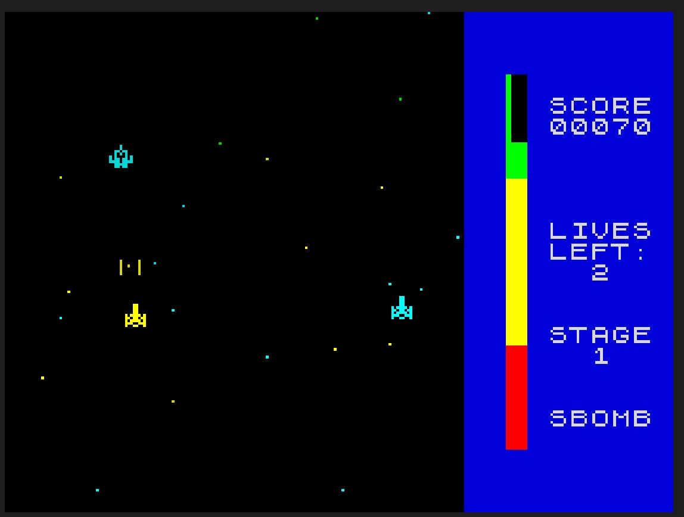
- "memoryPagingControl": true/false. Defaults to false. If enabled the ZX 128K memory banks can be paged in. Use this to simulate a ZX 128K. zsim uses USR0 mode. I.e. at startup the 48K ROM is paged in.
- "tbblueMemoryManagementSlots": true/false. Default to false. If enabled the ZX Next memory banking is enabled through registers 0x50-0x57. Use this to simulate ZX Next memory banking.
- "cpuLoadInterruptRange": Default is 1. The number of interrupts to calculate the CPU-load average from. 0 to disable. The CPU load is calculated by the number of executed t-states of all instructions without the HALT instruction divided by the number of all executed t-states. I.e. the time the CPU executes just HALT instructions is not considered as CPU load. Naturally, if you have turned off interrupts the CPU load is always 100%. Normally the average is calculated from interrupt to interrupt but you can extend the range to 2 or more interrupts. To disable the display choose 0.

- "vsyncInterrupt": Default is true if some ZX Spectrum feature is enabled otherwise false. If enabled an interrupt is generated after ca. 20ms (this assumes a CPU clock of 3.5MHz).


### ZEsarUX

The remote type is "zrcp".
ZEsarUX needs to run before the debug session starts and needs to be connected via a socket interface (ZRCP).
You need to enable the ZRCP in ZEsarUX. In ZEsarUX enable the socket zrcp protocol either by command-line ("--enable-remoteprotocol")
or from the ZEsarUX UI ("Settings"->"Debug"->"Remote protocol" to "Enabled").

You need to enable ZEsarUX in your Z80 program's launch.json configuration, e.g.:
~~~
    "remoteType": "zrcp",
    "zrcp": {
        "port": 10000
    }
~~~

The "zrcp" configuration allows the following additional parameters:
- "port": The ZEsarUX port. If not changed in ZEsarUX this defaults to 10000.
- "hostname": The host's name. I.e. the IP of the machine that is running ZEsarUX. If you are not doing any remote debugging this is typically "localhost". Note: Real remote debugging (emulator runnign on another PC) does work, but requires a mechanism to copy the .sna/nex file to the remote computer.
You don't have to enter a hostname, the default is "localhost".
- skipInterrupt: Is passed to ZEsarUX at the start of the debug session. If true (default is false) ZEsarUX does not break in interrupts (on manual break).
- "loadDelay": Some people encounter a crash (rainbow/kernel panic) of ZEsarUX at the start of a debug session when running under Windows. If that is true for you as well you can experiment with the "loadDelay" option which adds an additional delay at startup. This mitigates the problem.
The default for Windows is 100 (ms). If you run into this problem you can try to increase the value to 400 or even 1000. (You can also try smaller values than 100).


Notes:
- If ZEsarUX is used with the --tbblue-fast-boot-mode loading of tap files won't work.
- Important: Make sure that there is no UI window open in ZEsarUX when you try to connect it from vscode.
Sometimes it works but sometimes ZEsarUX will not connect.
You might get an error like "ZEsarUX did not communicate!" in vscode.
- If the DeZog functionality is not sufficient for you, you also have have full access to the ZEsarUX ZRCP through vscode's debug console.
Enter "-help" in the debug console to see all available commands.
Enter e.g. "-e h 0 100" to get a hexdump from address 0 to 99.


### Useful ZEsarUX command-line options.

To ease the usage of ZEsarUX with DeZog you can use several ZEsarUX command line options.
I have collected a few that I found useful:

```bash
# Try this if the ZEsarUX screen is not updated during debugging.
./zesarux --disable-autoframeskip &
```

```bash
# Start a "normal" ZX Spectrum (48k) and listen for connection from the DeZog.
./zesarux --enable-remoteprotocol &
```

```bash
# Start in ZX Next configuration. ZEsarUX skips the booting and emulates the esxdos rst routines.
# The file system is mounted via "--esxdos-root-dir".
# With this configuration ZX Next programs can be very easily developed and debugged.
# The Z80 program is passes as SNA file. "--sna-no-change-machine" disables the ZEsarUX automatic change to a 48k Spectrum machine.
#./zesarux --noconfigfile --machine tbblue --realvideo --enabletimexvideo --tbblue-fast-boot-mode --sna-no-change-machine --enable-esxdos-handler --esxdos-root-dir "\<path-to-your-z0-programs-dir\>" --enable-remoteprotocol &
```

```bash
# ZX Next: Start from MMC.
# To change an mmc file (e.g. on Mac) take the original tbblue.mmc, change the extension
# to .iso (tbblue.iso). Mount the iso image. Add your files. Unmount the image.
# Rename back to .mmc (optional).
./zesarux --machine tbblue --sna-no-change-machine --enable-mmc --enable-divmmc-ports --mmc-file "<your-mmc-image>"  --enable-remoteprotocol &
```

Please note: Normally you can set the commandline option also directly in the ZEsarUX Settings GUI.


### CSpect

The remote type is "cspect".
CSpect needs to run before the debug session starts and needs to be connected via a socket interface ([DZRP](design/DeZogProtocol.md)).
CSpect does not offer a socket interface to DeZog by itself it needs the help of [Dezog CSpect Plugin](https://github.com/maziac/DeZogPlugin).

You need to install it first. Please see [here](https://github.com/maziac/DeZogPlugin/blob/master/Readme.md#plugin-installation).


You need to enable CSpect in your Z80 program's launch.json configuration, e.g.:
~~~
    "remoteType": "cspect",
~~~

That should normally do.
If you need to configure the port use:
~~~
    "remoteType": "cspect",
    "cspect": {
        "port": 11000
    }
~~~

The "zrcp" configuration allows the following additional parameters:
- "port": The ZEsarUX port. If not changed in ZEsarUX this defaults to 10000.
- "hostname": The host's name. I.e. the IP of the machine that is running ZEsarUX. If you are not doing any remote debugging this is typically "localhost". Note: Real remote debugging (emulator running on another PC) does work, but requires a mechanism to copy the .sna/nex file to the remote computer.
You don't have to enter a hostname, the default is "localhost".

Note: You can start CSpect with the "-remote" option. In that case CSpect will not show it's debugger screen when stopped.


### macOS

To run CSpect under macOS or Linux you need to install Mono first.
A typical commandline to start CSpect looks like:
~~~
mono CSpect.exe -w4 -zxnext -nextrom -exit -brk -tv
~~~


### Serial Interface

The serial interface needs to be connected to the UART of a [ZX Spectrum Next](https://www.specnext.com).
In order to communicate with the ZX Next special SW needs to run on the Next.

Note: This does not work currently.

Example launch.json configuration:
~~~
    "remoteType": "serial",
    ???
~~~


## Usage

If you use any Remote other than the internal Simulator please make sure that it is started before you start the debug session with DeZog.

Now start DeZog by pressing the green arrow in the debug pane.

DeZog will now

- connect to the remote (e.g. open the socket connection to ZEsarUX)
- instruct the Remote (e.g. ZEsarUX) to load the nex, snapshot file or tap file
- set breakpoints (if there are breakpoints set in vscode)
- stop/break the just started assembler program

DeZog/vscode will now display the current PC (program counter) with a yellow arrow in the left side of your .asm file.
Left to that you see the VARIABLES section and the
call stack in the CALL STACK section.

You can now try the following:

- hover over registers in your source code -> should display the value of the register
- step-over, step-in etc.
- click in the call stack -> will navigate you directly to the file
- set breakpoints, press continue to run to the breakpoints


### Reverse Debugging

A special feature of DeZog is the possibility to reverse debug your program.
(Sometimes this is referred to as "[Time travel debugging](https://en.wikipedia.org/wiki/Time_travel_debugging)", "Historical debugging" or "Replay debugger".)
This means you can go "back in time" and inspect program flow and register values from the past.

The number of instructions you can step back is configurable and just a matter of memory.
E.g. one instruction line will occupy ca. 40 bytes of memory. So to store 1 second you need approx. 1 million instructions with a Z80 CPU that uses 4Mhz. This results in about 40MB.
Or in other words: if you would like to spend 1GB RAM you could store 25 secs.

The number of instructions is set in
~~~
"history": {
    "reverseDebugInstructionCount": 20000,
}
~~~
The default is set to 10000 instructions and should be more than enough for most use cases. (Use 0 to disable.)

Reverse debugging is basically done via the 2 red circled buttons in vscode:


The first does a single step back (one instruction) and the 2nd runs through the whole recorded history until it hits a breakpoint or until the end of the history is reached.

When you step back the lines in the source code are visually marked with a slight gray background so you know that you are in reverse debugging mode:


When you are in reverse debugging mode and do a forward continue/step-over/step-into/step-out the commands operate on the instruction history.
I.e. you can step back and forward in the code as you like.
Registers and the callstack are updated accordingly.

But please note: The history stores only the register values and stack contents. I.e. the memory or other HW state is not stored.
So whenever a memory location is changed from the program code in reverse debugging this will not be reflected in e.g. the memory view.
You can only rely on the register values.


#### History Spot

You can enable/disable a history spot around the current PC:
~~~
"history": {
    "spotCount": 10
}
~~~

If enabled (!= 0) you see the historic indices of the instructions. E.g. here:
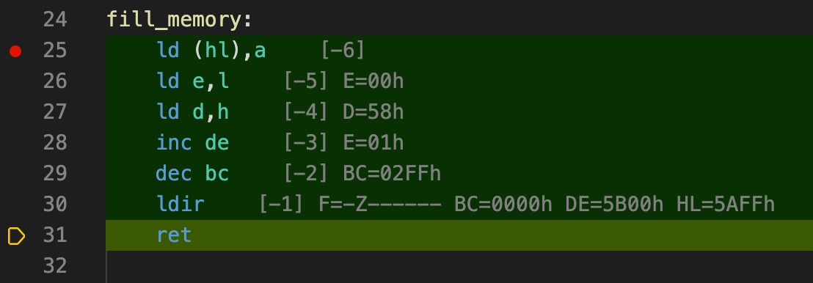

The indices are shown in brackets to the right.
The PC is currently in line 988.
The previous executed instruction is at index -1. Before at line 986 is index -2.
Before that instrucion at index -3 (line 1008) we see that there was a branch. Obviously the flags have been NZ and the branch was taken.

With the *History Spot* you can see what has just happened before without having to back step.

In case a line/instruction has been executed more than once you will find several indices in the brackets. E.g.:


When you step back you can also see the next instructions i.e. where you came from.
If 'spotcount' is e.g. 10 you see a maximum of 10 previous and next indices.

Here is an animated gif to illustrate the behaviour:


#### Breakpoints in Reverse Debug Mode

You can also use breakpoints during reverse debugging.
The normal (program counter related) breakpoints work just as you would expect.

It is also possible to add a condition. I.e. you can additionally test for certain register values.

But please note that during reverse debugging the memory contents is not evaluated. A breakpoint that checks for memory is not evaluated correctly. In such a case the breakpoint will fire always.
E.g. a condition like this
~~~
b@(HL) == 0
~~~
will be evaluated to true always so that you don't miss such a breakpoint.


### Code Coverage

Code coverage can be enabled/disabled via:
~~~
"history": {
    "codeCoverageEnabled": true
}
~~~

The default is 'true'.

If code coverage is enabled all executed lines in your source code are visually marked with a green background.
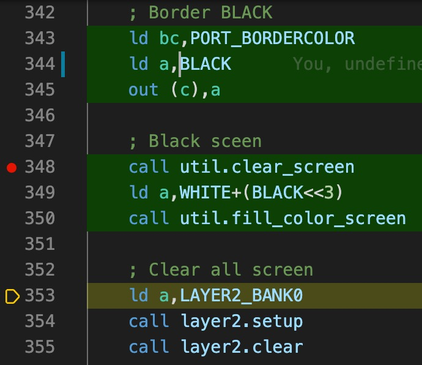

You can use the code coverage feature in several ways. E.g. in unit tests you can directly see which lines of code are not covered. I.e. for which conditions you still need to write a test.
Or during debugging you can clear the code coverage (palette command "dezog: Clear current code coverage decoration") and then step over a function (a CALL). Afterwards you can navigate into the function and see what has been executed and which branches have not.


### Stop Debugging

To stop debugging press the orange square button in vscode. This will stop DeZog and disconnect from ZEsarUX.
After disconnecting ZEsarUX, ZEsarUX will also leave cpu-step mode and therefore continue running the program.


### WPMEM

WPMEM offers a way to put watch points persistently into your sources.

WPMEM is put into a comment in your assembler source files. As the comments also appear in the .list file these comments will be parsed when the .list file is read.

Here are some examples how this looks like in code:

~~~assembly
fill_colors:    ; WPMEM, 5, w
    defb RED, YELLOW, BLUE, GREEN, MAGENTA
fill_colors_end:
~~~
~~~assembly
; WPMEM 0x0000, 0x4000
~~~
~~~assembly
; WPMEM fill_colors, 5, r
~~~

Syntax:

~~~
WPMEM [addr [, length [, access]]]
~~~
with:
- addr = address (or label) to observe (optional). Defaults to current address.
- length = the count of bytes to observe (optional). Default = 1.
- access = Read/write access (optional). Possible values: r, w or rw. Defaults to rw.

I.e. if you omit all values a watch-point will be created for the current address.
E.g. in the first example a watchpoint is created that checks that the array (fill_colors) is not overwritten with something else.

The most often used form of WPMEM is to put a WPMEM simply after an byte area that is used for reading/writing. E.g. like this:

~~~assembly
scratch_area:
    defs 10
    defb 1      ; WPMEM
~~~
In this example it is assumed that your algorithm uses the 'scratch_area' to write some data. You defined that this area is 10 bytes in size. Thus if someone would write after
these 10 bytes it would mean that the algorithm is wrong.
Please note that we waste 1 byte (defb 1) for this safety check. This byte is not to be used by any pointer in our program. So writing/reading to it is a failure and the program will break if this happens.

Another useful scenario is to secure the stack for over- or underrun:

~~~assembly
; Reserve stack space
stack_bottom:
    defw    0   ; WPMEM, 2
    defs    50*2, 0
stack_top:
    defw 0  ; WPMEM, 2
~~~
This will observe 2 addresses at the bottom and 2 addresses at the top.


Caveats:

- Other than for sjasmplus WPMEMs are evaluated also in not assembled areas, e.g. in case the surrounding IF/ENDIF is not valid.
- The 'memory breakpoints' used in ZEsarUX have 2 specific limitations:
    - Imagine you have set a watchpoint WPMEM at address 4000h.
If a byte is written to 4000h, e.g. with "LD (4000h),A" the break will occur, no problem.
But if a word (i.e. 2 bytes) is written to 4000h like in "LD (4000h),HL" the lower address is not checked. I.e. a break will not happen. Only the upper address is checked. If the word would be written to 3FFFh e.g. with "LD (3FFFh),HL" then a break would happen.
    - You need to make sure that the debug settings for the memory breakpoints are set to "Settings->Debug->Breakp. behaviour" to "On Change". Otherwise a break will be done on every instructions following the memory access until another different memory access happens.
    But even if set to "On Change" it's problematic. If afterwards another access to the same address happens no break will occur.

Notes:

- WPMEMs are disabled by default. If you want to have WPMEMs enabled after launch then put "-WPMEM enable" in the "commandsAfterLaunch" settings.
- (sjasmplus) If you use label names make sure to use the global name (i.e. full dot notation).


### ASSERT

Similar to WPMEM you can use ASSERTs in comments in the assembler sources.
An ASSERT is translated by DeZog into a breakpoints with an "inverted" condition.
For all ASSERTs in your source code DeZog can set the correspondent breakpoints automatically at startup.

The ASSERT syntax is:

~~~
; [.*] ASSERT expr [;.*]
~~~
'expr' is just like the expressions in [breakpoints](#vscode-breakpoint-conditions).

Examples:
~~~
; ASSERT HL <= LBL_END+2
ld a,b  ; Check that index is not too big ASSERT B < (MAX_COUNT+1)/2
ld de,hl    ; ASSERT A < 5 && hl != 0 ; Check that pointer is alright
~~~

As an ASSERT converts to a breakpoint it is always evaluated **before** the instruction.
I.e. the following check will most probably not work as expected.

~~~
ld a,c  ; ASSERT a < 7
~~~
A is not loaded yet when the ASSERT is checked. So use

~~~
ld a,c
; ASSERT a < 7
~~~
instead: The ASSERT is on the next line i.e. at the address after the "LD" instruction and thus A is checked correctly.

Notes:

- ASSERT is not available in ZEsarUX.
- The asserts are checked in the list file. I.e. whenever you change an ASSERT it is not immediately used. You have to assemble a new list file and start the debugger anew.
- ASSERTs are disabled by default. If you want to have asserts enabled after launch then put "-ASSERT enable" in the "commandsAfterLaunch" settings.
- Other than for sjasmplus ASSERTs are evaluated also in not assembled areas, e.g. in case the surrounding IF/ENDIF is not valid.
- As a special form you can also define an ASSERT without any condition. This will act as a breakpoint that will always be hit when the program counter reaches the instruction.
- sjasmplus: If you use label names make sure to use the global name (i.e. full dot notation).


### LOGPOINT

Another special keyword is LOGPOINT in comments in the assembler sources.
A LOGPOINT is translated by DeZog into a breakpoint that does not stop execution but instead prints a log message.

The LOGPOINT syntax is:

~~~
; LOGPOINT [group] text ${(var):signed} text ${reg:hex} text ${w@(reg)} text ${b@(reg):unsigned}
~~~
with:

- [group]: (Note: the [ ] are meant literally here) The log group. Separate log groups might be turned on/off separately. E.g. "[SPRITES]". If omitted "DEFAULT" is used as group.
- reg: a register name, e.g. A, BC, HL, IX, H, IXL.
- var: a label.
- text: A simple text that may include variables. Here are a few examples for variables:
    - ```LOGPOINT [SPRITES] Status=${A}, Counter=${(sprite.counter):unsigned}```
    - ```LOGPOINT Status=${w@(HL)}, ${(DE)}, ${b@(DE)}```
Note: ${(DE)} is equal to ${b@(DE)} and prints the byte value at DE.

Notes:

- The LOGPOINTs are checked in the list file. I.e. whenever you change a LOGPOINT it is not immediately used. You have to assemble a new list file and start the debugger anew.
- LOGPOINTs are disabled by default. If you want to have logpoints enabled after launch then put "-LOGPOINT enable" in the "commandsAfterLaunch" settings. Note: you can also turn on only specific groups.
- LOGPOINTs are not available in ZEsarUX.
- sjasmplus: If you use label names make sure to use the global name (i.e. full dot notation).
- LOGPOINTs can do math with fixed labels but not with registers. I.e. "${b@(my_data+5)}" will work. It will statically calculate my_data+5 and lookup the memory value. But "${b@(IX+1)}" will not work as it would have to dynamically calculate "IX+1" at runtime.


### vscode breakpoint

You simply set a breakpoint by clicking left to the line where you want the breakpoint to be.
A red dot indicates the presense of a breakpoint.

Breakpoints can be set only per line. I.e. it is not possible to have multiple breakpoints in one line.


__Breakpoint conditions:__

Along with breakpoints you can also use breakpoint conditions. The breakpoint condition is checked additionally whenever a breakpoint is fired at a certain address.
Only if also the breakpoint condition is met the program execution will stop.

Breakpoint conditions can be any valid expression including labels, registers and parenthesis.
Examples:
~~~
BC==0x12FA
DE==HL+1
(A&7Fh) >= 10
D==5 || B==0 && C==1
B >= (MAX_COUNT+1)/2
b@(mylabel) == 50
w@(mylabel) == 0x34BC
b@(mylabel+5) == 50
b@(mylabel+A) == 50
b@(HL) > 10
~~~

Note 1: "&&" has higher priority than "||".

Note 2: Brackets, "()", are used only for prioritization of the expression. To read the contents of an address use "b@(...)" or "w@(...)". "b@(address)" and "w@(address)" return the byte and word contents at 'address'

Note 3: Some of the operators (like "!=", "||" or "b@(...)" are converted to the ZEsarUX format style (i.e. "=", "OR", "peek(...)") but you can also use the ZEsarUX style directly.


__Breakpoints in interrupts:__

You can also set breakpoints in interrupts.

But when you also set the launch.json option "skipInterrupts" to true you will feel that the behaviour is somewhat strange:
If the breakpoint is hit the program will stop, but because of "skipInterrupts" it will stop after the interrupt finished.

Although the behavior is correct it looks like the program is randomly stopping.


### vscode logpoints

You can set vscode logpoints on the fly during debugging with the vscode logpoint feature.

The log message that you enter will appear in the "Debug Console" if the logpoint is hit.
You can also use variables similar to the description in chapter [LOGPOINT].
E.g. use "Counter=${(sprite.counter)}" as a log message.

Note: logpoints are not available in ZEsarUX.


### Debug Console

The debug console prints out useful information and might be used to enter additional commands and communicate with the emulator.

E.g. on every step-over you get an info about the used T-states and time. This can be used to measure the performance of sub routines. (Note: the calculation of the time uses the CPU frequency, if the CPU frequency changes during execution the calculated time will be wrong.)
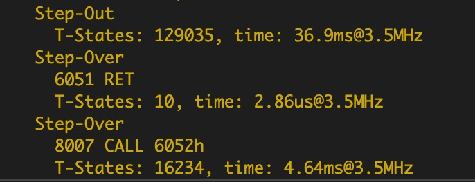


You can add commands directly at the debug console. E.g. you can pass commands directly to ZEsarUX or you can enable/disable WPMEM.

Enter '-help' in the debug console to see all available commands.

The debug console can normally be found in the bottom of vscode after successful launch of the debugger:
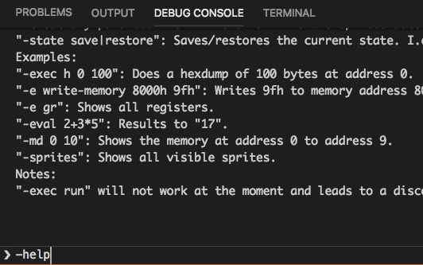


#### Execute emulator commands

Withe "-exec" you can directly pass emulator commands to the emulator.
The response is send to the debug console.
If you add the argument "-view" the output is redirected into a view.
Currently this is only available to ZEsarUX.
For ZEsarUX you can e.g. use

~~~
-exec -view help
~~~
to put the ZEsarUX zrcp help documentation in a view in vscode.
You see the result here:
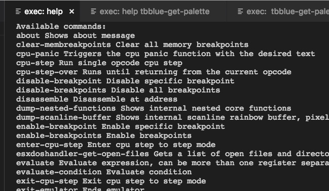


#### State Save/Restore

It is possible to save/restore the current machine state (mainly RAM, Z80 registers) during a debug session.
I.e. you can save the state prior to a problem and reload the state to investigate the problem once again.

Use

~~~
-state save state_name
~~~
to save the current state.
And

~~~
-state restore state_name
~~~
to restore the state.


With state_name being a name or number of your choice, e.g.:

~~~
-state save 1
or
-state save just-before-crash
~~~

are valid names.


Note: What is saved depends solely on the Remote, i.e. ZEsarUx or the internal simulator.


#### Memory Dumps

If you enter

~~~
-md <address> <size>
~~~
in the debug console you open a memory viewer.

Here an example:
z80
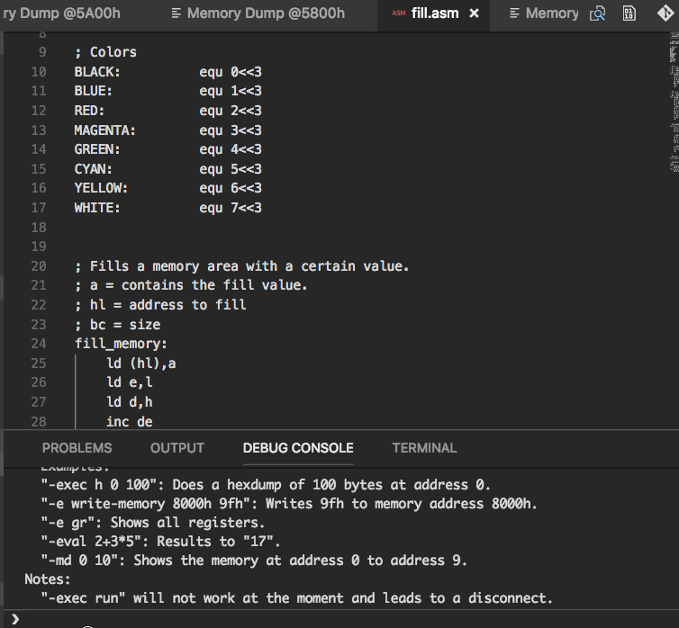

The memory viewer will offer a few extra infos:

- The address is printed on the left side.
- The selected area (address, size) is emphasized, the other area is grayed out.
- Any address for which a label exists is underlined.
- Addresses that are pointed to by registers (e.g HL, DE, IX) are displayed with a colored background (here HL got green).
- Any changed value is highlighted in red.
- Hovering over values reveals more information. In the picture above the move was hovering over the red "42". You can see the associated address, label(s) and (since the value was changed) also the previous value.

You can also open multiple memory dumps at once by adding more address/size ranges to the command, e.g.:

~~~
-md 0 0x100 0x8000 0x40 0x8340 0x10
~~~
This opens a memory dump view 3 memory blocks.
Please note that if you enter overlapping blocks the dump will merge them in the display.

DeZog opens a special memory viewer by itself on startup: it shows the locations around some registers. I.e. you can directly see where the registers are pointing at and what the values before and after are. This memory will change its range automatically if the associated register(s) change.

The register memory view:

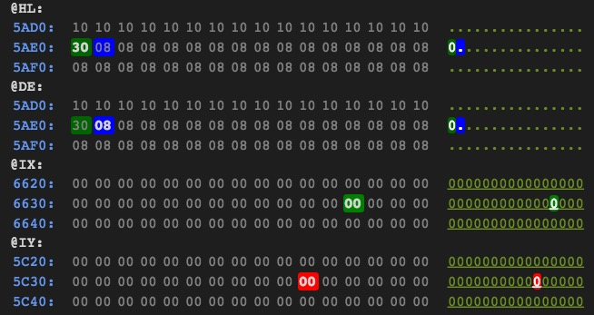


##### Memory Editor

In the memory viewer you can edit individual memory values with a double-click on the value.
You can now enter the new value as hex, decimal, bin or even as a math formula.

Any changed value wil be updated automatically in all memory views.
Note: The changed value is not updated immediately in the WATCH area. There you need to 'step' once to get the updated values.


##### Configuration

The visualization of the memory viewer can be configured. All values are collected under the 'memoryViewer' setting. You can change the registers in the registers-memory-viewer, the colors of the register pointers and the format of values that is shown when you hover over the memory values.


#### Sprites & Patterns

You can open a view which displays the current sprite slots by entering

~~~
-sprites
~~~

This will display all 'visible' sprites in a table with all associated attributes like mirroring, rotation, palette offset and pattern id.

Note: When hovering over a column title you will also get an explanation.

Furthermore it also offers a simplified screen view which displays the border, the screen area and the sprites clipping rectangle.
Here you can see all sprites from the list above with right offsets and rotation, no matter if they are visible or clipped.
(Of course, if the list shows only visible sprites, you will also only see visible sprites in the screen view.)

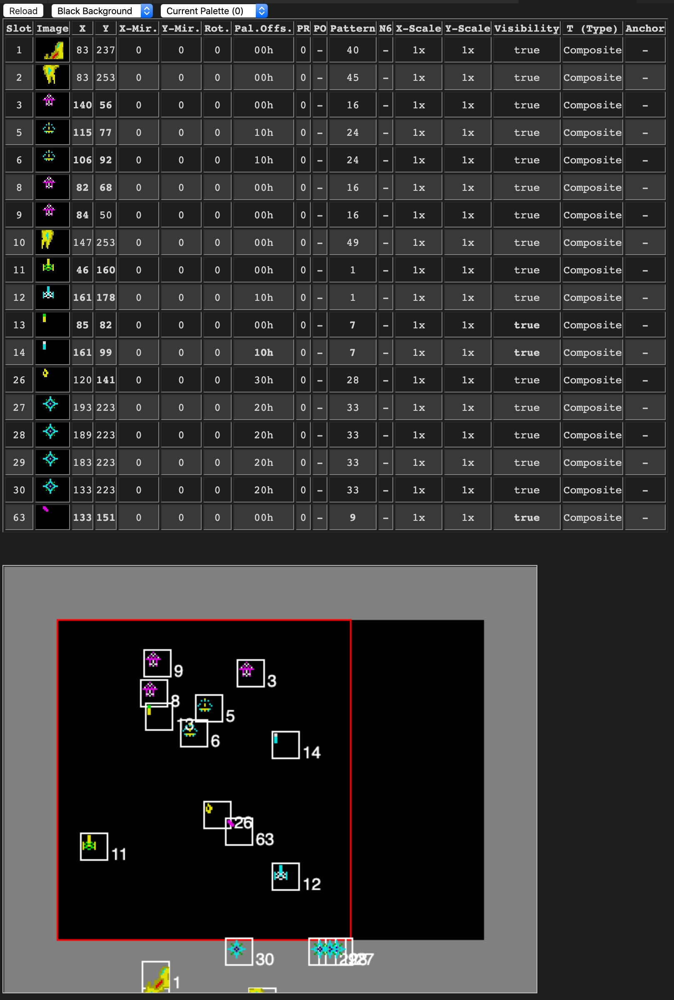

Each sprite is shown by a rectangle and it's image. Additional you see it's slot number at the right bottom.

The viewer is also capable to display 4 bit color pattern sprites and relative sprites.

Here is an example view from [ped7g's](https://github.com/MrKWatkins/ZXSpectrumNextTests/tree/develop/Tests/Sprites/BigSprite4b) sprite test programs that show anchor and relative uniform sprites in different rotations.

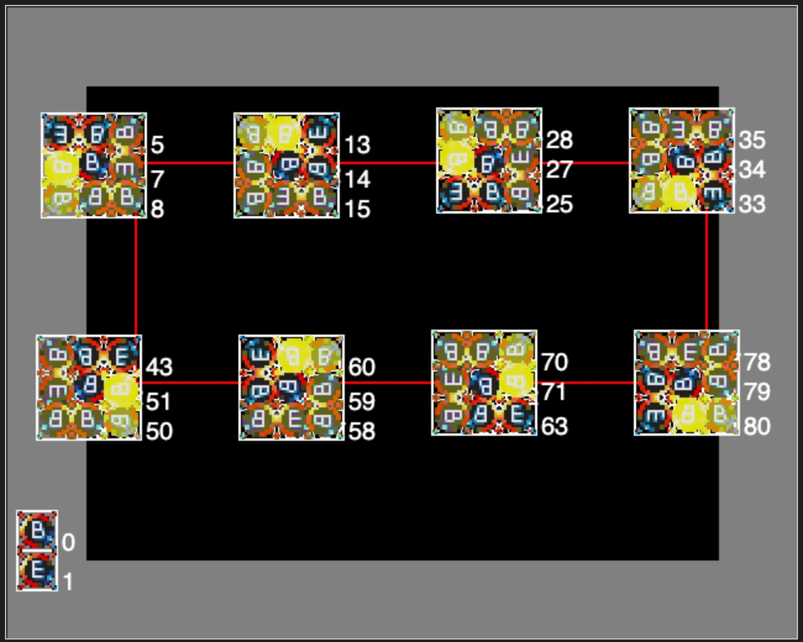

The last 2 columns show the composition: Relative sprites show 'Relative' here and have a reference to the anchor sprite index.
The anchor sprites are either 'Composite' or 'Uniform' which selects how the following relative sprites are used in respect to mirroring, rotation and scaling.
All sprites belonging to the same anchor get the same background color so you can easily spot where the next "big" sprite begins.


If you only want to watch specific sprites you can add the slot numbers as arguments.

Example: "-sprite 10-15 20+3 33" will observe sprite slots 10, 11, 12, 13, 14, 15, 20, 21, 22, 33 only.

The view will update the sprite's position and attributes on every 'step' in the debugger.
If a new sprite appears the corresponding  sprite pattern will be loaded as well. But for performance reasons: On a 'step' the sprite patterns for already existing sprites are not updated. On a 'break' the sprite patterns will always be updated.
So in most of the cases the sprite patterns will show correctly.
However for special situations it is also possible to reload the patterns with a button.
If the sprite pattern might be outdated you see a '*' left to the 'Reload' button.


If the background color does not offer enough contrast for the sprite pattern it is possible to change the background color with the dropdown menu.

To see just the sprite patterns you can use

~~~
-patterns
~~~
with the same syntax.

It will display the sprite patterns.
It is also possible to change the palette if the current palette is not suitable.

For each of the 64 indices 3 patterns are shown:
- the 8bit color pattern (256 bytes)
- the 4bit color pattern for N6=0 (128 bytes)
- the 4bit color pattern for N6=1 (128 bytes)

Note: From the pattern memory it cannot be known if the pattern is used as 8bit or 4bit pattern so all possible patterns are shown in this view.
This, of course, means that normally only the 8bit or the 4bit color pattern is valid. Decision is done by the sprite.

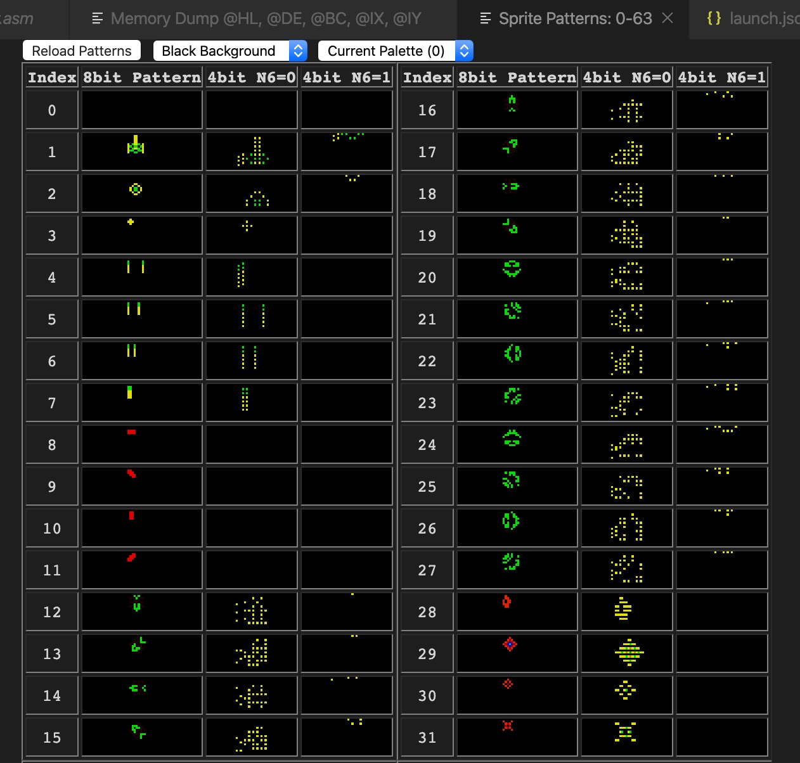


### WATCHES

If you select a label with the mouse in the source code and do a right-click you can add it to the watches. The watches show a memory dump for that label.
The dump is updated on each step.
DeZog cannot determine the "type" and size the data associated with the label therefore it assumes 100 bytes or words and shows both,
a byte array and a word array, on default.
However you have a few options if you add more parameters to the label.

If you double-click on the label in the WATCHES area you can edit it. You can tell DeZog the number of elements to show and if it should show bytes, words or both.
The format is:

~~~
label,size,types
~~~
with

- label: The label, e.g. LBL_TEXT or just a number e.g. 0x4000
- size: The number of elements to show. Defaults to 100 if omitted.
- types: Determines if a byte array ('b'), a word array ('w') or both ('bw') should be shown. Defaults to 'bw'.

Here is an example:

~~~
fill_colors,5,b
~~~
It shows an array of 5 bytes beginning at label fill_colors.


### Change the Program Counter

The PC can be changed via the menu. Click in the source line. Do a right-click
and choose "Move Program Counter to Cursor".

See [Notes](#Notes).


## Unittests

You can use the DeZog to execute unit tests.
Please see [here](UnitTests.md).


## Known Issues

- DeZog/CSpect (v2.12.26):
  - Watchpoints do not work and are therefore disabled.
  - Z80 unit tests do not work. Because of above watchpoint problem.
- "ASSERT"s are set on startup but if for the same address an breakpoint already exists (e.g. from a previous session) it is not changed. If e.g. the ASSERT / breakpoint condition is changed it is not updated. Workaround: Remove all breakpoints manually before debugging the assembler program.
- Hovering does work only on the file that is currently debugged, i.e. where the PC (program counter) is. This seems to be a restriction of vscode. debug-adapter-protocol issue #86 https://github.com/microsoft/debug-adapter-protocol/issues/86
- Windows only: Some people encounter a crash (rainbow/kernel panic) of ZEsarUX at the start of a debug session.
If that is true for you as well you can experiment with the "[loadDelay](documentation/Usage.md#zesarux)" option which adds an additional delay at startup. This mitigates the problem.
The default for Windows is 100 (ms). If you run into this problem you can try to increase the value to 400 or even 1000. (You can also try smaller values than 100).


## Notes

- Don't use "-exec run" in the debug console. It will lead to a disconnection of ZEsarUX. Instead use the continue button (the green arrow).


